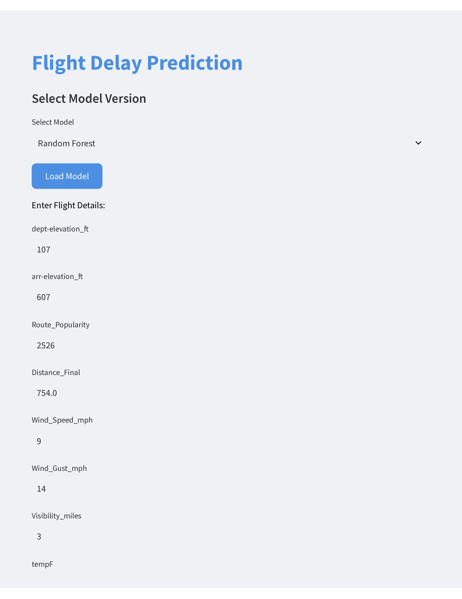
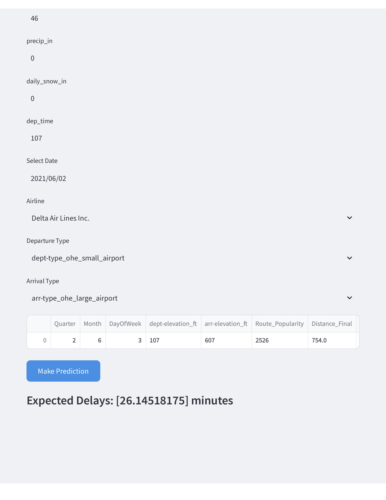

# Streamlit Web Application for Flight Delay Prediction

### Repository Structure
```
web-app/
│
├── dockerfiles/
│   ├── Dockerfile
├── src/
│   ├── app.py
│   ├── aws_import.py
├── config/
│   ├── config.yaml
│   ├── logging/
│       └── local.conf
├── tests/
│   ├── unit_test.py
├── README.md
└── requirements.txt
```

- `config`: Main config and logging command center.
- `dockerfiles`: File that is used to buid image and run the image. This is for pipeline.py.
- `src`: Contains all source codes to power-up the app.py, also inside src, and test_modules.py under tests folder.
- `tests`: Contains another Dockerfile for Unit Testing purpose, and test_modules.py for unit testing.

**Note**: requirements.txt has slightly different lists of packages compared to `pipeline` folder's requirements.txt due to the inclusion of streamlit related libaries.

### How We Built Streamlit App

**This assumes that we followed the steps in the pipeline folder**

Once we have all three models (PCR, Random Forest, and Gradient Boosting) trained and saved in S3, we begin the process of remotely importing these pre-trained models.

First, before we connect to AWS, ensure that we have an available ECR Public Repository. Then, we sign in to AWS and ensure sure to use `View Push Commands` in the newly created repository.

```bash
aws sso login

aws ecr-public get-login-password --region us-east-1 | docker login --username AWS --password-stdin public.ecr.aws/XXXX
```

**Note:** We anonymized the public ECR unique ID to be `XXXX` for privacy & security purpose.

Once we have the new Docker Image built, make sure to follow the command below to deploy in ECR:

```bash
# Build the Docker Image
docker build -t project-app -f dockerfiles/Dockerfile .

# Tag the Image to Public ECR AWS Image
docker tag project-app:latest public.ecr.aws/XXXX/project-app:latest

# Publish the Image into ECR Repository
docker push public.ecr.aws/XXXX/project-app:latest
```

After deploying the Stremailt Docker Image to ECR, we connect the ECR to the ECS.

Unlike the `pipeline` pipeline process where we can trigger one-time `Task`, we realized that this web-app will require a new `Service` running under FARGATE at real-time. This will create a new `Task`

Once we set construct the service with FARGATE and connect to ECR while maintaining the Port at 80, we will see the following website that will redirect you in `Networking` Tab for `Task`.

Below images are examples of how we can observe the Streamlit Web Application for Flight Delay by clicking at URL address generated by ECS.




